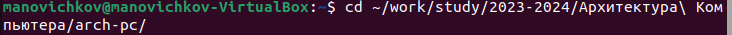
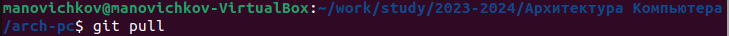
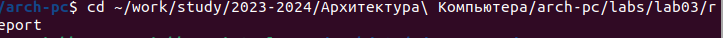
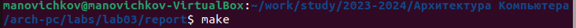
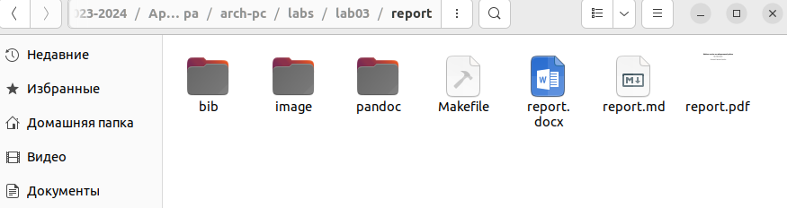
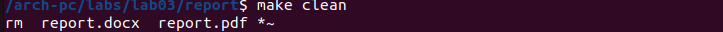
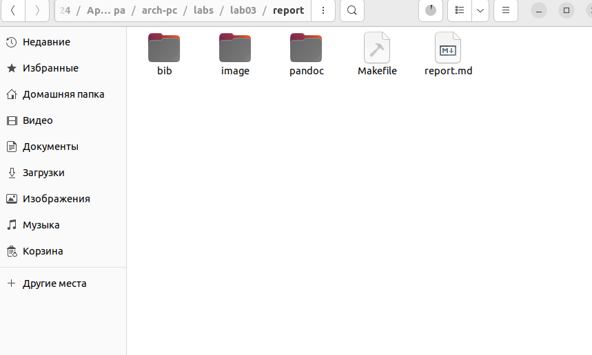
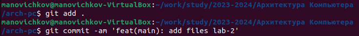

---
## Front matter
title: "Отчёт по лабораторной работе №3"
subtitle: "Дисциплина: Архитектура компьютеров"
author: "Новичков Максим Алексевич"

## Generic otions
lang: ru-RU
toc-title: "Содержание"

## Bibliography
bibliography: bib/cite.bib
csl: pandoc/csl/gost-r-7-0-5-2008-numeric.csl

## Pdf output format
toc: true # Table of contents
toc-depth: 2
lof: true # List of figures
lot: true # List of tables
fontsize: 12pt
linestretch: 1.5
papersize: a4
documentclass: scrreprt
## I18n polyglossia
polyglossia-lang:
  name: russian
  options:
	- spelling=modern
	- babelshorthands=true
polyglossia-otherlangs:
  name: english
## I18n babel
babel-lang: russian
babel-otherlangs: english
## Fonts
mainfont: PT Serif
romanfont: PT Serif
sansfont: PT Sans
monofont: PT Mono
mainfontoptions: Ligatures=TeX
romanfontoptions: Ligatures=TeX
sansfontoptions: Ligatures=TeX,Scale=MatchLowercase
monofontoptions: Scale=MatchLowercase,Scale=0.9
## Biblatex
biblatex: true
biblio-style: "gost-numeric"
biblatexoptions:
  - parentracker=true
  - backend=biber
  - hyperref=auto
  - language=auto
  - autolang=other*
  - citestyle=gost-numeric
## Pandoc-crossref LaTeX customization
figureTitle: "Рис."
tableTitle: "Таблица"
listingTitle: "Листинг"
lofTitle: "Список иллюстраций"
lotTitle: "Список таблиц"
lolTitle: "Листинги"
## Misc options
indent: true
header-includes:
  - \usepackage{indentfirst}
  - \usepackage{float} # keep figures where there are in the text
  - \floatplacement{figure}{H} # keep figures where there are in the text
---

# Цель работы
Целью работы является освоение процедуры оформления отчетов с помощью легковесного
языка разметки Markdown.

# Задание
1. Установка необходимого ПО
2. Заполнение отчета по выполнению лабораторной работы №3 с помощью языка разметки Markdown
3. Выполнение заданий для самостоятельной работы

# Теоретическое введение
Markdown - легковесный язык разметки, созданный с целью обозначения форматирования в простом тексте, 
с максимальным сохранением его читаемости. Markdown поддерживает как встраивание фрагментов кода в 
предложение, так и их размещение между предложениями в виде отдельных огражденных блоков. Огражденные блоки
кода — это простой способ выделить синтаксис для фрагментов кода. Внутритекстовые формулы делаются аналогично 
формулам LaTeX. В Markdown вставить изображение в документ можно с помощью непосредственного указания адреса 
изображения

# Выполнение лабораторной работы

Перехожу в каталог курса сформированный при выполнении лабораторной работы номер №2:

ОБновляю локальный репозиторий, скачав изменения из удаленного репозитория с помощью команды git pull

Перехожу в каталог с шаблоном отчета по лабораторной работе № 3

Провожу компиляцию шаблона с использованием Makefile. Для этого ввожу команду make

При успешной компиляции должны сгенерироваться файлы report.pdf и report.docx.
Откываю и провереяю корректность полученных файлов.

Удаляю полученные файлы с использованием Makefile. Для этого ввожу команду make clean

Проверяю, что после этой команды файлы report.pdf и report.docx были удалены.
# Самостоятельная работа 
В соответствующем каталоге сделайте отчёт по лабораторной работе № 2 в формате
Markdown. В качестве отчёта необходимо предоставить отчёты в 3 форматах: pdf, docx
и md.
.png)
Загрузите файлы на github.

# Выводы
В ходе лабораторной работы я освоил процедуры оформления отчетов с помощью легковесного языка разметки Markdown

