title: "Лабораторная работа №4."
subtitle: "Создание и процесс
обработки программ на языке ассемблера NASM"
author: "Новичков Максим Алексеевич"
# Цель работы
Освоение процедуры компиляции и сборки программ, написанных на ассемблере NASM.
# Задание

# Выполнение лабораторной работы
Создайте каталог для работы с программами на языке ассемблера NASM 

Перехожу в созданый каталог

Создайте текстовый файл с именем hello.asm
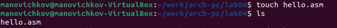

откройте этот файл с помощью любого текстового редактора, например, gedit

NASM превращает текст программы в объектный код.
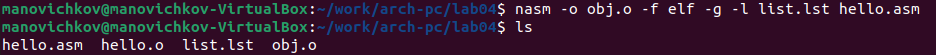

Чтобы получить исполняемую программу, объектный файл
необходимо передать на обработку компоновщику
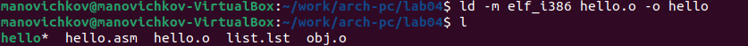

Запустить на выполнение созданный исполняемый файл, находящийся в текущем каталоге,
можно, набрав в командной строке
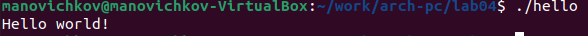

#Задание для самостоятельной работы
С помощью команды cp создайте копию файла
hello.asm с именем lab4.asm
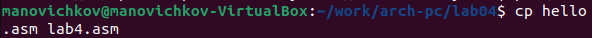

Превравщение файла в объективный код
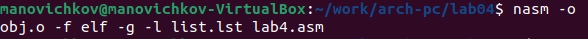

Передаем компановщику файл lab4.o что бы получить исполняемую программу
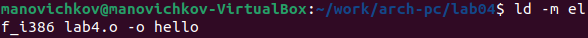

Запустить на выполнение созданный исполняемый файл, находящийся в текущем каталоге
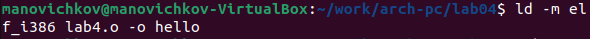

Копирую файл hello.asm и файла lab4.asm в основную ветку гит хаба
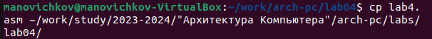

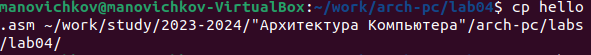

Копируйте файлы  в Ваш глобальный репозиторий в ката-
лог
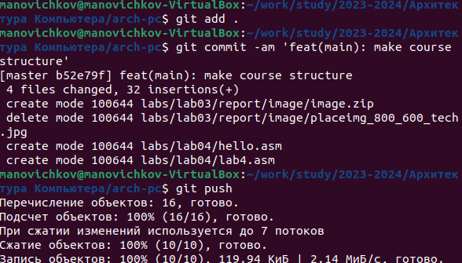
# Выводы
Сегодня я научился осваивать процедуры компиляции и сборки программ, написанных на ассемблере NASM.

