---
## Front matter
title: "ОТЧЕТ ПО ЛАБОРАТОРНОЙ РАБОТЕ № 5"
subtitle: "дисциплина:	Архитектура компьютера"
author: "Новичков Максим Алексеевич"

## Generic otions
lang: ru-RU
toc-title: "Содержание"

## Bibliography
bibliography: bib/cite.bib
csl: pandoc/csl/gost-r-7-0-5-2008-numeric.csl

## Pdf output format
toc: true # Table of contents
toc-depth: 2
lof: true # List of figures
fontsize: 12pt
linestretch: 1.5
papersize: a4
documentclass: scrreprt
## I18n polyglossia
polyglossia-lang:
  name: russian
  options:
	- spelling=modern
	- babelshorthands=true
polyglossia-otherlangs:
  name: english
## I18n babel
babel-lang: russian
babel-otherlangs: english
## Fonts
mainfont: PT Serif
romanfont: PT Serif
sansfont: PT Sans
monofont: PT Mono
mainfontoptions: Ligatures=TeX
romanfontoptions: Ligatures=TeX
sansfontoptions: Ligatures=TeX,Scale=MatchLowercase
monofontoptions: Scale=MatchLowercase,Scale=0.9
## Biblatex
biblatex: true
biblio-style: "gost-numeric"
biblatexoptions:
  - parentracker=true
  - backend=biber
  - hyperref=auto
  - language=auto
  - autolang=other*
  - citestyle=gost-numeric
## Pandoc-crossref LaTeX customization
figureTitle: "Рис."
tableTitle: "Таблица"
listingTitle: "Листинг"
lofTitle: "Список иллюстраций"
lolTitle: "Листинги"
## Misc options
indent: true
header-includes:
  - \usepackage{indentfirst}
  - \usepackage{float} # keep figures where there are in the text
  - \floatplacement{figure}{H} # keep figures where there are in the text
---

# Цель работы

Освоить инструкции языка ассемблера mov.Приобрести знания использования Midnight Commander.

# Задание

Написать 2 программы по примеру и изменить их структуру по условию.

# Выполнение лабораторной работы

## Порядок выполнения лабораторной работы

Открываем Mid. Commander (рис. @fig:001)

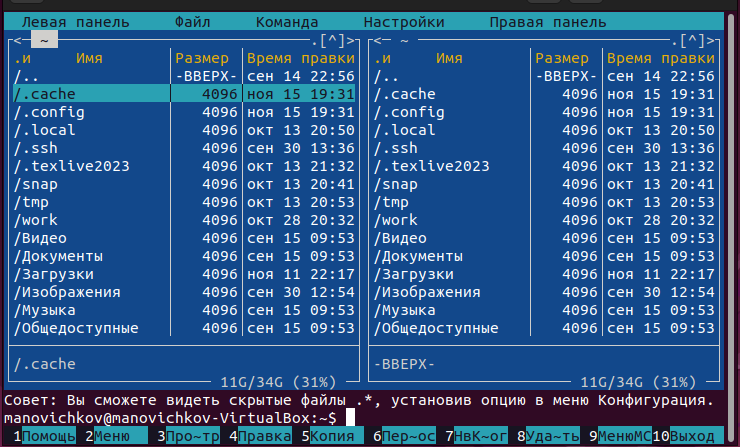{#fig:001 width=70%}

Создаем каталог lab05 (рис. @fig:002)

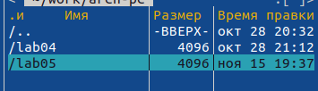{#fig:002 width=70%}

Создаем файл lab5-1.asm (рис. @fig:003)

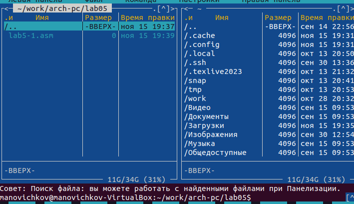{#fig:003 width=70%}

Открываем файл для редактирования и заполняем его по листингу (рис. @fig:004)

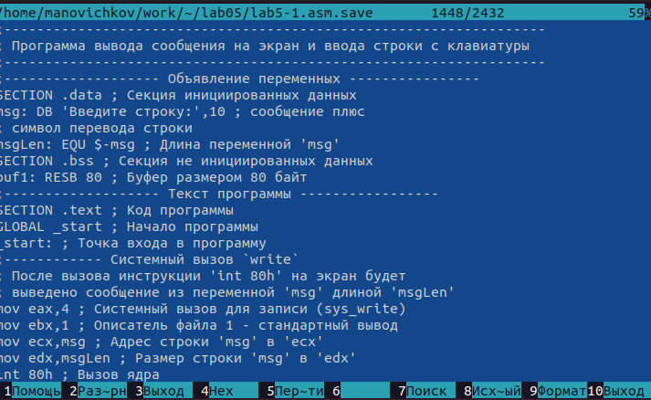{#fig:004 width=70%}

Открывем файл и просматриваем (рис. @fig:005)

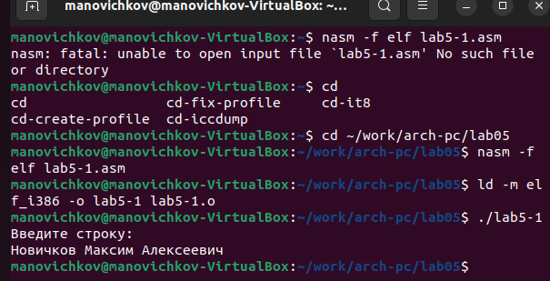{#fig:005 width=70%}

Транслируем текст программы и запускаем файл (рис. @fig:006)

{#fig:006 width=70%}

Копируем файл в нужную директорию (рис. @fig:007)

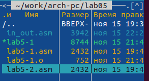{#fig:007 width=70%}

Создаем копию файла (рис. @fig:008)

{#fig:010 width=70%}

Проверяем созданный файл (рис. @fig:008)

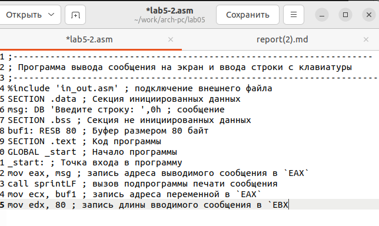{#fig:008width=70%}

Открываем новый файл и заполняем его  (рис. @fig:009)

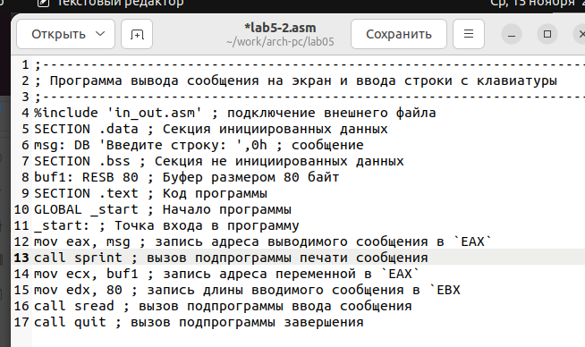{#fig:009width=70%}

Открываем файл для редактирования и меняем sprintLF на sprint(рис. @fig:010)

{#fig:010 width=70%}

Транслируем и запускаем файл(рис. @fig:011)

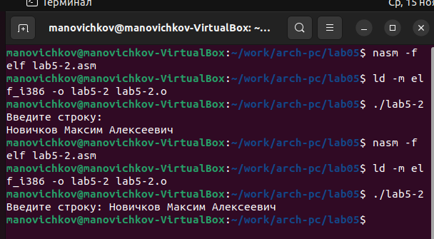{#fig:011 width=70%}

## Задание для самостоятельной работы

Создаем копию файла lab5-1.asm (рис. @fig:012)

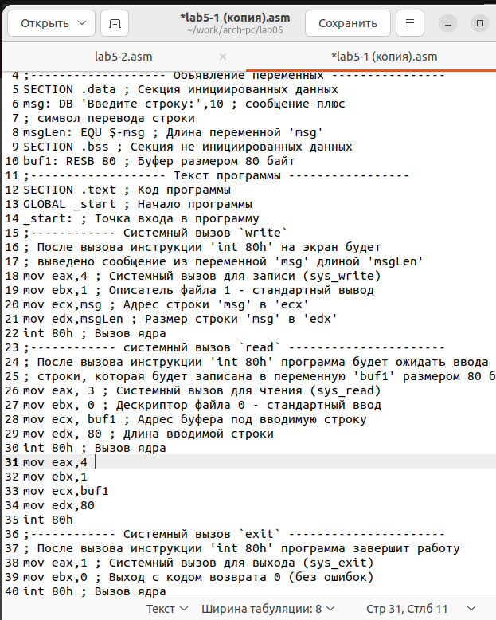{#fig:012 width=70%}

Редактируем файл, чтобы введеный текст с клавиатуры выводился в консоль (рис. @fig:013)

{#fig:013 width=70%}

Транслируем файл и запускаем программу (рис. @fig:014)

{#fig:014 width=70%}

Создаем копию файла lab5-2.asm (рис. @fig:015)

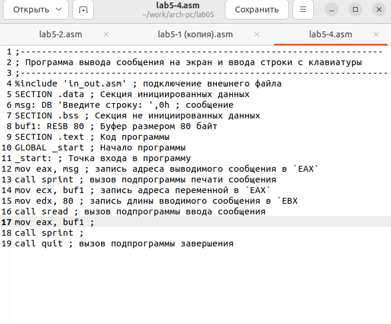{#fig:016 width=70%}

Транслируем файл и запускаем (рис. @fig:010)

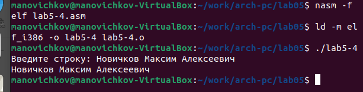{#fig:017 width=70%}

# Выводы

Мы приобрели навыки работы с Midnight Commander и освоили инструкции mov.
