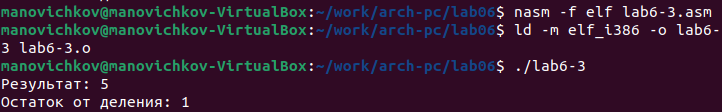
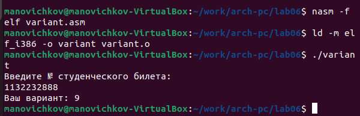
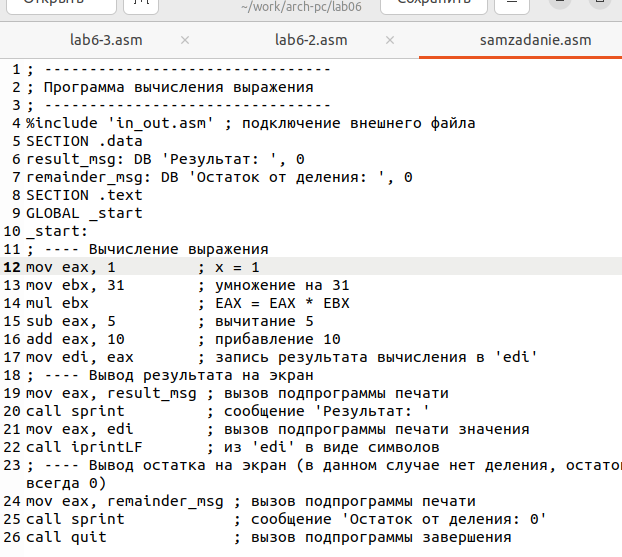

---
## Front matter
title: "ОТЧЕТ ПО ЛАБОРАТОРНОЙ РАБОТЕ № 6"
subtitle: "дисциплина:	Архитектура компьютера"
author: "Новичков Максим Алексеевич"

## Generic otions
lang: ru-RU
toc-title: "Содержание"

## Bibliography
bibliography: bib/cite.bib
csl: pandoc/csl/gost-r-7-0-5-2008-numeric.csl

## Pdf output format
toc: true # Table of contents
toc-depth: 2
lof: true # List of figures
fontsize: 12pt
linestretch: 1.5
papersize: a4
documentclass: scrreprt
## I18n polyglossia
polyglossia-lang:
  name: russian
  options:
	- spelling=modern
	- babelshorthands=true
polyglossia-otherlangs:
  name: english
## I18n babel
babel-lang: russian
babel-otherlangs: english
## Fonts
mainfont: PT Serif
romanfont: PT Serif
sansfont: PT Sans
monofont: PT Mono
mainfontoptions: Ligatures=TeX
romanfontoptions: Ligatures=TeX
sansfontoptions: Ligatures=TeX,Scale=MatchLowercase
monofontoptions: Scale=MatchLowercase,Scale=0.9
## Biblatex
biblatex: true
biblio-style: "gost-numeric"
biblatexoptions:
  - parentracker=true
  - backend=biber
  - hyperref=auto
  - language=auto
  - autolang=other*
  - citestyle=gost-numeric
## Pandoc-crossref LaTeX customization
figureTitle: "Рис."
tableTitle: "Таблица"
listingTitle: "Листинг"
lofTitle: "Список иллюстраций"
lolTitle: "Листинги"
## Misc options
indent: true
header-includes:
  - \usepackage{indentfirst}
  - \usepackage{float} # keep figures where there are in the text
  - \floatplacement{figure}{H} # keep figures where there are in the text
---
# Цель работы

Научиться писать и анализировать ассемблерный код с арифметическими операциями и понять синтаксис. Работа поможет развить навыки низкоуровневого программирования и понимания работы процессора.

# Задание

Написать несколько программ для вычислений.

# Выполнение лабораторной работы
## Порядок выполнения лабораторной работы

Создайте каталог для программ лабораторной работы № 6, перейдите в него и создайте файл lab6-1.asm (рис. @fig:001)

{#fig:001 width=70%}

Рассмотрим примеры программ вывода символьных и численных значений. Программы будут выводить значения записанные в регистр eax (рис. @fig:002)

{#fig:002 width=70%}

{#fig:002 width=70%}

Преобразуем текст программы из Листинга 6.1 с использованием этих функций. (рис. @fig:003)

{#fig:003 width=70%}

{#fig:003 width=70%}

Изменим символы на числа (рис. @fig:004)

{#fig:004 width=70%}

{#fig:004 width=70%}

В качестве примера выполнения арифметических операций в NASM приведем программу вычисления арифметического выражения f(x) = (5 * 2+ 3)/3 (рис. @fig:005)

{#fig:005 width=70%}

{#fig:005 width=70%}

Измените текст программы для вычисления выражения f(x) = (4 * 6 + 2)/5. Создайте исполняемый файл и проверьте его работу. (рис. @fig:006)

{#fig:006 width=70%}

{#fig:006 width=70%}

рассмотрим программу вычисления варианта задания по номеру студенческого билета (рис. @fig:006)

{#fig:006 width=70%}

{#fig:006 width=70%}

## Ответы на вопросы
1. Строка "moveax.rem" и строка "call sprint" отвечают за вывод на экран сообщения 'Ваш вариант:'.
2. Эти инструкции используются для чтения строки с вводом данных от пользователя. Начальный адрес строки сохраняется в регистре есх, а количество символов в строке (максимальное количество символов, которое может быть считано) сохраняется в регистре edx. Затем вызывается процедура sread, которая выполняет чтение строки.
3. Инструкция "call atoi" используется для преобразования строки в целое число. Она принимает адрес строки в регистре еах и возвращает полученное число в регистре еaх.
Строка "xoredx.edx" обнуляет регистр. edx перед выполнением деления. Строка "movebx,20" загружает значение 20 в регистр ebx. Строка "divebx" выполняет деление регистра еах на значение регистра ebx с сохранением частного в регистре еах и остатка в регистре edx,
5. Остаток от деления записывается в регистр edx.
6. Инструкция "inc edx" используется для увеличения значения в регистре edx на
1. В данном случае, она увеличивает остаток от деления на 1.
1з
7. Строка "moy eax.edx" передает значение остатка от деления в регистр eax. 36 Строка "call iprintLF" вызывает процедуруiprintLF для вывода значения на экран вместе с переводом строки.

## Задание для самостоятельной работы

Написать программу вычисления выражения y = f(x). Программа должна выводить
выражение для вычисления, выводить запрос на ввод значения x, вычислять заданное выражение в зависимости от введенного x, выводить результат вычислений. Создайте исполняемый файл и проверьте его работу для значений x1 и x2 (рис. @fig:007)

{#fig:007 width=70%}

{#fig:007 width=70%}

{#fig:007 width=70%}

{#fig:007 width=70%}

# Выводы

В работе были изучены арифметические операции в языке ассемблера NASM.Был рассмотрен синтаксис и были написаны и проанализированы программы на ассемблере, которые используют арифметические операции для решения различных задач.
