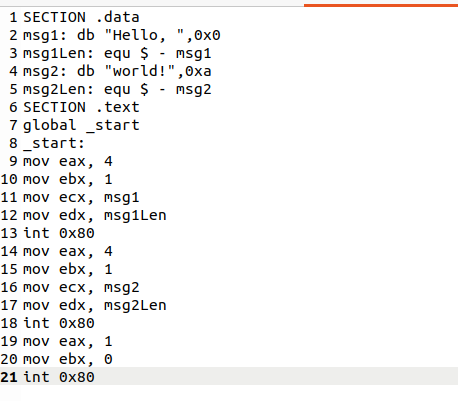
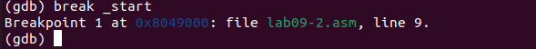

---
## Front matter
title: "Отчёт по лабораторной работе №9"
subtitle: "Дисциплина: Архитектура компьютера"
author: "НовичковМаксим Алексеевич"

## Generic otions
lang: ru-RU
toc-title: "Содержание"

## Bibliography
bibliography: bib/cite.bib
csl: pandoc/csl/gost-r-7-0-5-2008-numeric.csl

## Pdf output format
toc: true # Table of contents
toc-depth: 2
lof: true # List of figures
lot: true # List of tables
fontsize: 12pt
linestretch: 1.5
papersize: a4
documentclass: scrreprt
## I18n polyglossia
polyglossia-lang:
  name: russian
  options:
	- spelling=modern
	- babelshorthands=true
polyglossia-otherlangs:
  name: english
## I18n babel
babel-lang: russian
babel-otherlangs: english
## Fonts
mainfont: PT Serif
romanfont: PT Serif
sansfont: PT Sans
monofont: PT Mono
mainfontoptions: Ligatures=TeX
romanfontoptions: Ligatures=TeX
sansfontoptions: Ligatures=TeX,Scale=MatchLowercase
monofontoptions: Scale=MatchLowercase,Scale=0.9
## Biblatex
biblatex: true
biblio-style: "gost-numeric"
biblatexoptions:
  - parentracker=true
  - backend=biber
  - hyperref=auto
  - language=auto
  - autolang=other*
  - citestyle=gost-numeric
## Pandoc-crossref LaTeX customization
figureTitle: "Рис."
tableTitle: "Таблица"
listingTitle: "Листинг"
lofTitle: "Список иллюстраций"
lotTitle: "Список таблиц"
lolTitle: "Листинги"
## Misc options
indent: true
header-includes:
  - \usepackage{indentfirst}
  - \usepackage{float} # keep figures where there are in the text
  - \floatplacement{figure}{H} # keep figures where there are in the text
---

# Цель работы

Целью лабораторной работы является приобретение навыков написания программ с использованием подпрограмм, знакомство с методами отладки при помощи GDB и его основными возможностями.

# Выполнение лабораторной работы

## Реализация подпрограмм в NASM

1. С помощью утилиты mkdir создаем директорию, в которой будем создавать файлы с программами для лабораторной работы №9. Переходим в созданный каталог с помощью утилиты cd. С помощью утилиты touch создаем файл lab09-1.asm (рис. [-@fig:001]).

{ #fig:001 width=70% }

2. Внимательно изучив текст программы из листинга 9.1, вводим его в файл lab09-1.asm (рис. [-@fig:002]).

{ #fig:002 width=70% }

Далее создаем исполняемый файл и запускаем его (рис. [-@fig:003], .

{ #fig:003 width=70% }

Изменим текст программы, добавив подпрограмму _subcalcul в подпрограмму _calcul, для вычисления выражения f(g(x)), где x вводится с клавиатуры, f(x) = 2x + 7, g(x) = 3x − 1 (рис. [-@fig:004]).

{ #fig:004 width=70% }

Далее создаем исполняемый файл и запускаем его (рис. [-@fig:005]).

{ #fig:005 width=70% }

## Отладка программам с помощью GDB

Создаем новый файл lab09-2.asm в каталоге (рис. [-@fig:006]).

{ #fig:006 width=70% }

Открываем файл и заполняем его в соответствии с листингом 9.2 (рис. [-@fig:007]).

{ #fig:007 width=70% }

Проверим работу программы, запустив ее в оболочке GDB с помощью команды run (рис. [-@fig:008]).

{#fig:008 width=70%}

Для более подробного анализа программы установим брейкпоинт на метку _start, с которой начинается выполнение любой ассемблерной программы, и запустим её (рис. [-@fig:009]).

{#fig:009 width=70%}

Посмотрим дисассимилированный код программы с помощью команды disassemble начиная с метки _start (рис. [-@fig:010]).

.

{#fig:011 width=70%}

Различия отображения синтаксиса машинных команд в режимах ATT и Intel:

1. Порядок операндов: В ATT синтаксисе порядок операндов обратный, сначала указывается исходный операнд, а затем - результирующий операнд. В Intel синтаксисе порядок обычно прямой, результирующий операнд указывается первым, а исходный - вторым.
2. Разделители: В ATT синтаксисе разделители операндов - запятые. В Intel синтаксисе разделители могут быть запятые или косые черты (/).
3. Префиксы размера операндов: В ATT синтаксисе размер операнда указывается перед операндом с использованием префиксов, таких как “b” (byte), “w” (word), “l” (long) и “q” (quadword). В Intel синтаксисе размер операнда указывается после операнда с использованием суффиксов, таких как “b”, “w”, “d” и “q”.
4. Знак операндов: В ATT синтаксисе операнды с позитивными значениями предваряются символом “$". В Intel синтаксисе операнды с позитивными значениями могут быть указаны без символа "$”.
5. Обозначение адресов: В ATT синтаксисе адреса указываются в круглых скобках. В Intel синтаксисе адреса указываются без скобок.
6. Обозначение регистров: В ATT синтаксисе обозначение регистра начинается с символа “%”. В Intel синтаксисе обозначение регистра может начинаться с символа “R” или “E” (например, “%eax” или “RAX”).

Включим режим псевдографики для более удобного анализа программы (рис. [-@fig:012]).

{#fig:012 width=70%}

### Добавление точек останова

Проверим установленные точки останова с помощью команды info breakpoints (рис. [-@fig:013]).

{#fig:013 width=70%}

Определим адрес предпоследней инструкции (mov ebx,0x0) и установим точку останова (рис. [-@fig:018]).

{#fig:014 width=70%}

Посмотрим информацию о всех установленных точках останова (рис. [-@fig:019]).

{#fig:014 width=70%}

### Работа с данными программы в GDB

Посмотрев содержимое регистров с помощью команды info registers (или i r), замечаем, что во время выполнения команд менялись регистры: ebx, ecx, edx, eax, eip (рис. [-@fig:015]).

{#fig:015 width=70%}

С помощью команды x &<имя переменной> также можно посмотреть содержимое переменной. Посмотрим значение переменной msg1 по имени (рис. [-@fig:016]).

{#fig:016 width=70%}

Изменим первый символ переменной msg1 (рис. [-@fig:017]).

{#fig:017 width=70%}

Изменим первый символ переменной msg2 (рис. [-@fig:018]).

{#fig:018 width=70%}

Выведем в различных форматах (в шестнадцатеричном формате, в двоичном формате и в символьном виде) значение регистра edx (рис. [-@fig:019]).

{#fig:019 width=70%}

Изменим регистр ebx (рис. [-@fig:020]).

{#fig:020 width=70%}

Выводятся разные значения, так как именно команда без кавычек присваивает регистру вводимое значение.

Завершим выполнение программы с помощью команды continue (сокращенно c) и выйдем из GDB с помощью команды quit (сокращенно q) (рис. [-@fig:021]).

{#fig:021 width=70%}

## Выполнение заданий для самостоятельной работы

1. Преобразуем программу из лабораторной работы №8 (Задание №1 для самостоятельной работы), реализовав вычисление значения функции f(x) как подпрограмму.

Вставляем отредактированную программу из лабораторной работы №8 с добавлением подпрограммы (рис. [-@fig:022]).

{#fig:022 width=70%}

Далее создаем исполняемый файл и запускаем его (рис. [-@fig:038], [-@fig:023]).

{ #fig:023 width=70% }

# Выводы

В ходе выполнения лабораторной работы мы приобрели навыки написания программ с использованием подпрограмм, познакомились с методами отладки при помощи GDB и его основными возможностями.

::: {#refs}
:::
